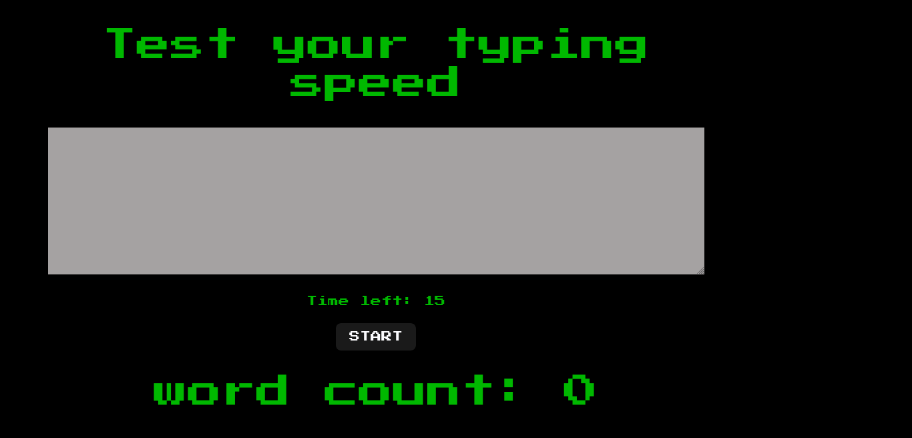

## Type-speed-game

## Table of contents

- [Overview](#overview)
  - [The challenge](#the-challenge)
  - [Screenshot](#screenshot)
  - [Links](#links)
- [My process](#my-process)
  - [Built with](#built-with)
  - [What I learned](#what-i-learned)
- [Acknowledgments](#acknowledgments)

## Overview
A type speed checking game written in React

### The challenge

Users should be able to:

- Type words into the text field before remain time elapses
- Get total word count

### Screenshot

### Video

https://user-images.githubusercontent.com/30356189/194474390-bbe79822-a4cd-4954-a5df-02da7d510f80.mp4

### Links

- Live Site URL: [app url](https://type-speed-game-theta.vercel.app/)

## My process

### Built with

- Semantic HTML5 markup
- CSS custom properties
- Mobile-first workflow
- React

### What I learned
- Implementing React hooks namely: useState, useRef, useEffect

## Acknowledgments

- All this wouldn't have been possible if it were not from the knowledge passed from tutors at [scrimba](https://www.google.com/url?sa=t&rct=j&q=&esrc=s&source=web&cd=&cad=rja&uact=8&ved=2ahUKEwiR-eK3n8z6AhVRsaQKHcIfClUQFnoECBYQAQ&url=https%3A%2F%2Fscrimba.com%2Fabout&usg=AOvVaw1LGuR5RjRSUYOF1gxZtpwO)

